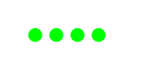

# meter.js

## Introduction:
- meter.js is a package which contains 6 different types of building a progress bar!

## Types:
- Horizontal Bar
- Vertical Bar
- Circular
- Donut
- Pie Chart Style
- Dots Bar

## Configuration:

> NOTE: ALL THE FUNCTIONS ARE SAME FOR EVERY TYPES OF PROGRESS BAR. ONLY CUSTOMISATION VARIES IN SOME BARS

Setting up a bar is a piece of cake with this package!

```js
// Setting up a horizontal progress bar
const { Horizontal } = require("meter.js");

const Bar = new Horizontal()
Bar.setMax(100)
Bar.setMin(1)
Bar.setCurrent(6)

const Render = Bar.build();

require("fs").writeFileSync("render.png", Render);
```

## And the result would be:


## Properties:

### The General Customization Properties are:

```js
{
bgColor: "white", // The Background Color [EXCLUDING PIE]
fillColor: "lime", // The Fill Color [EXCLUDING PIE]
textEnabled: true, // The text in the center of the bars (Can be disabled if needed) [EXCLUDING DOTS]
textColor: "black" // Color of the text [EXCLUDING DOTS]
}
```

### Types Exclusive Customization Properties are:

- Dots:
```js
{
dots: 5 // The amount of dots in the progress bar
}
```

- Pie:
```js
{
primaryColor: "lime", // The percentage display color
secondaryColor: "white" // The background color
}
```

## Other Examples
### Circular

### Donut

### Dots

### Vertical

### Pie


This project is licensed under the [MIT License](LICENSE)